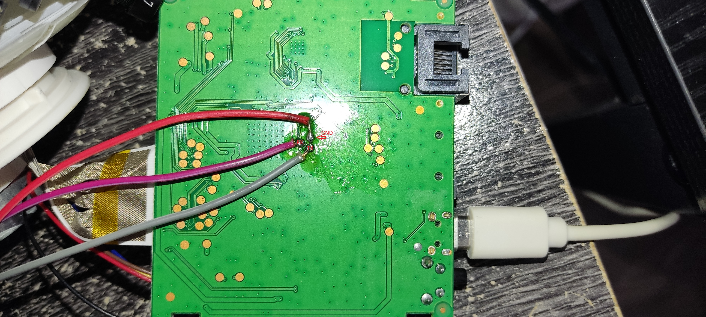

# anykav380-ak3918-hacking
Bringing a generic chinese camera based on Anyka AK3918 V380 off cloud, enabling RTSP and ONVIF for devices with no built-in functionalities and other boogaloo

As I never so far actually found the time to work on this repository, I revisited the project and started doing some adjustments.
Everything I'm working on right now is based on two principles: 1) Being off-cloud and 2) Work idiot-proof with Home Assistant

## PTZ Daemon
So, first I wanted to make enhancements to the beautiful program for PTZ control made by @kuhnchris. I noticed that whenever I compiled the program myself and tried to run it on my camera, on the initialization stage the motor turned to the left and then I got a "floating point exception. core dumped" exception
Initially I noticed the substancially smaller size of my executable so I realized that the custom ptz-daemon compiled exec provided by @warren-bank was compiled with static libraries. Fast forward I discover that the driver provided by the SDK was not compatible with my hardware and the driver included by @kuhnchris was an older version and was missing a few functions such as a command to stop the PTZ rotation. After a few hours of trial and error reverse engineering I managed to get the SDK's updated version to work so I upload it here for the time being for anyone facing the exact same issues.

The issue was with the default values for the total steps and cycle steps in the ak_motor struct in ak_drv_ptz.c The final adjusted values are:
For the horizontal motor:
```
.fulldst_step = 4209,
.cycle_step = 4209,
```
For the vertical motor:
```
.fulldst_step = 2161,
.cycle_step = 2161,
```
Some minor adjustments to the driver have been made, mostly cleaning up a few parts of code and addidng a few extra debug messages which I might remove in future commits.

## UART - Serial pins - Hidden beyond recognition
.. I really don't want to remember how much time I spent tracking those but here you go, hope it saves someone some time in the future.

Main circuit board:


Serial pins:




## Everything else
Years later I still haven't sit down to document everything as I wanted, so I apologize to everyone that might have been expecting insight from my documentation. Few things might be added in the future (or not).

## Nothing wouldn't be possible without all the beautiful work from the below people:

@kuhnchris https://github.com/kuhnchris/IOT-ANYKA-PTZdaemon/

@warren-bank https://github.com/warren-bank/mirror-firmware-lightbulb-camera-Anyka-ak3918-by-Gergely-Palfi

@MuhammedKalkan https://github.com/MuhammedKalkan/Anyka-Camera-Firmware/
